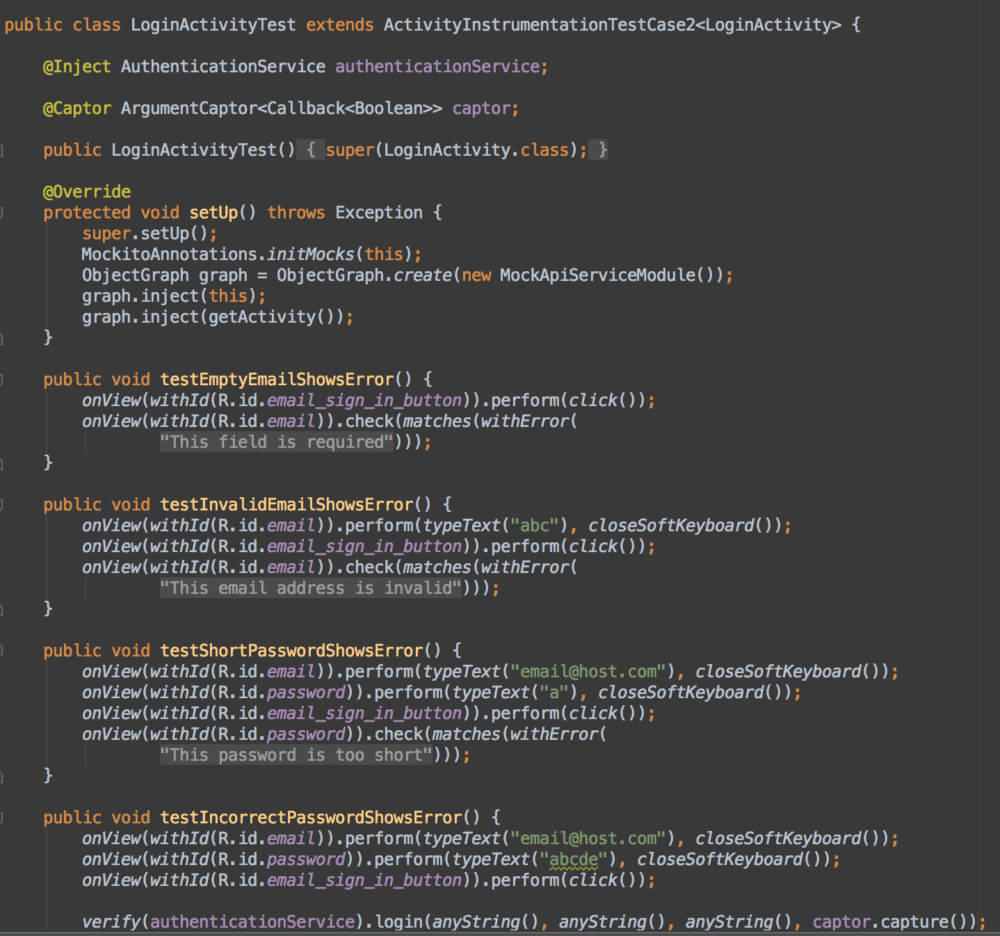

## Automated Testing for _**Modern**_ Android Applications

---

## Andy Dyer
### _**+AndrewDyer || @dammitandy**_

---


---

## Music Library


---

## Wrist Presenter


---

## Records,
## Coffee & Beer

---

>"Ich lerne Deutsch."


---

### Making Android apps testable

---

### Dynamic languages
### _**"Tests shouldn't drive implementation.**"_


---

### Static languages
### _**"You know nothing."**_


---

## Making Android apps testable

- Dependency injection
- Mocking & stubbing
- Unit & integration tests

---

### Dependency injection

---

## Dependency injection

- Decouples application components
- Classes receive dependencies, don’t have to know where to find them or how to create them
- Makes it easy to swap components for mocks in tests

---

### Basic dependency injection

```java
public class Beer {
  Water water;
  Barley barley;
  Hops hops;

  public Beer(Water water, Barley barley, Hops hops) {
    this.water = water;
    this.barley = barley;
    this.hops = hops;
  }
}
```

---

## Dagger
### _**A Java dependency injection library**_

---

## Dagger

- Define dependencies at compile time to avoid reflection at runtime
- Compiler validates modules and injections
- Jake Wharton “Architecting Android Applications with Dagger" _*goo.gl/JIM7KI*_

_*square.github.io/dagger*_

---

## Dagger Modules

```java
@Module(injects = {MyActivity.class, MyFragment.class})
public class MyModule {
  @Provides @Singleton
  public MyService provideMyService() {
    return new MyService();
  }
}
```

---

## Dagger Object Graph

```java
public class MyApplication extends Application {
  private dagger.ObjectGraph objectGraph;

  @Getter static MyApplication instance;

  @Override
  public void onCreate() {
    super.onCreate();
    instance = this;
    objectGraph = dagger.ObjectGraph.create(new MyModule());
  }

  public void inject(Object dependent) {
    objectGraph.inject(dependent);
  }
}
```

---

## Dagger Dependency Injection

```java
public class MyFragment extends Fragment {
  @Inject MyService service;

  @Override
  public void onViewCreated(View view, Bundle savedInstanceState) {
    MyApplication.getInstance().inject(this);
    service.getMyData();
  }
}
```

---

### Mocking & Stubbing

---

## Mocking & Stubbing

- Substitute runtime implementation for something that can be predictably tested in isolation
- Verify behavior

---

## Mockito
### _**A Java mocking library**_

---

## Mockito

- Mock/stub dependencies and function return values
- Inject mocks to validate behavior in tests
- Use included Hamcrest matchers for clear, readable tests

_*code.google.com/p/mockito/*_

---

## Using Mockito

```java
MyClass mocked = mock(MyClass.class);

// code to inject mock & load activity/fragment
// ...

verify(mocked).getMyData(anyInt(), anyString());
```
---

### Unit & Integration Tests

---

>"Tests or it didn't happen."



---

## Espresso
### _**An Android UI test library**_

---

## Espresso

- Handles activity creation & state sync
- Simple, concise API
- Really fast!

_*code.google.com/p/android-test-kit*_

---

## Using Espresso

```java
public class MyActivityTest extends ActivityInstrumentationTestCase2<MyActivity> {

  public MyActivityTest() { super(MyActivity.class); }

  @Override
  protected void setUp() throws Exception {
    super.setUp();
    getActivity(); // trigger activity launch
  }

  public void testInvalidEmailShowsError() {
    onView(withId(R.id.email)).perform(typeText("abc"), closeSoftKeyboard());
    onView(withId(R.id.email_sign_in_button)).perform(click());
    onView(withId(R.id.email)).check(matches(withError(
            getActivity().getString(R.string.error_invalid_email))));
  }
}
```

---

## Sample application overview

- Retrofit API with sample requests
- Dagger module
- Lombok & Android Studio plugin
- Login activity
- Activity with list fragment to make API request and display data

---

## Haben Sie Fragen?

---

# Code & Slides
_github.com/abdyer/android-test-demo_


